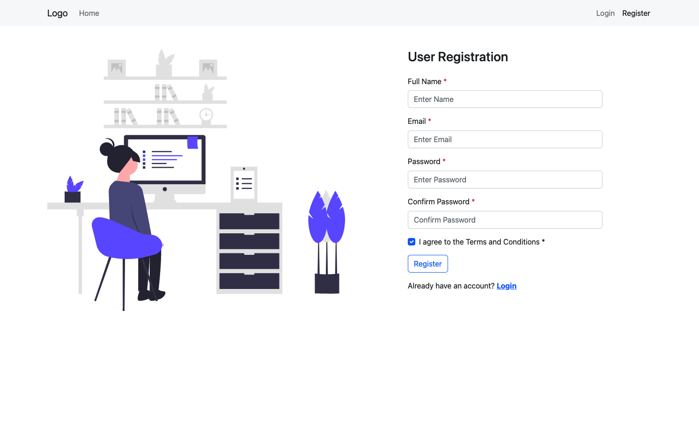
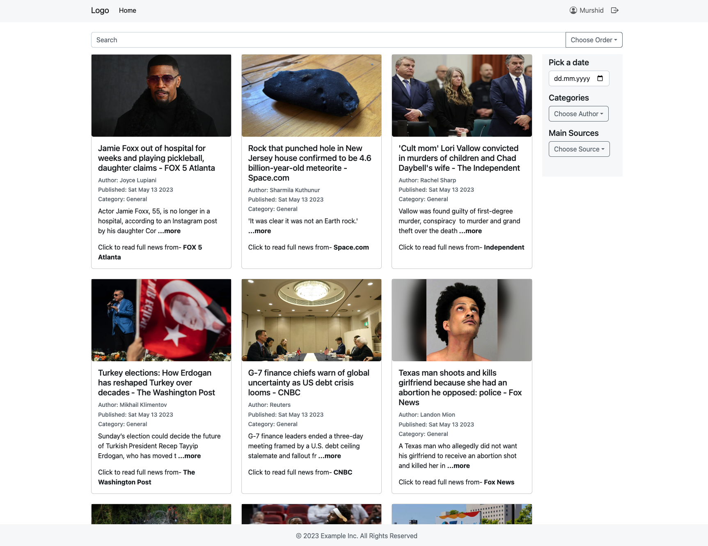

# Welcome to Laravel, MySQL, React Dockerized Project

This project is a starter template for running a Laravel, MySQL, and React project using Docker.

## Prerequisites

### Before you start, make sure you have the following tools installed:

-   Docker Engine 20.10.0 or later

-   Docker Compose 1.29.0 or later

## Getting Started

1. Clone this repository to your local machine:

```
git clone https://github.com/murschid/innoscripta.git
```

2. Go to the project directory:

```
cd innoscripta
```

3. Build and start the Docker containers:

```
docker-compose up --build -d
```

This command will start the following Docker containers:<br>

`backend`: the Laravel application server running on port 8000<br>

`mariadb`: the MySQL database server running on port 3306<br>

`frontend`: the React development server running on port 8080<br>

4. Migrate the database:

-   Run the following command to connect to the laravel-app container:

```
docker-compose exec backend sh
```

Then, run the following command to migrate the database:

```
php artisan migrate
```

5. To update news automatically in every hour, execute below command (`it may not work in local machine!`)

```
php artisan insert-news
```

6. Access the Laravel backend application:

-   Open your web browser and go to `http://localhost:8000`. You should see the Laravel welcome page.

-   If the `php artisan insert-news` command doesn't work in your local machine then execute `http://127.0.0.1:8000/insert-news` from your browser URL. It will insert the news to database from 3 different API and redirect to `http://localhost:8080` (frontend) user login page.

7. Access the React frontend application:

-   Open your web browser and go to `http://localhost:8080`. You should see the React application.

## Stopping the Containers

To stop the Docker containers, press `Ctrl+C` in the terminal window where you started the containers. Alternatively, you can run the following command in the project directory:

```
docker-compose down
```

This command will stop and remove the containers, as well as the network and volumes created by-

```
docker-compose up
```

## Running without Docker

Before running without Docker kindly make sure that Composer is installed and your MySQL database server is running on `PORT 3306`

1. Clone this repository to your local machine:

```
git clone https://github.com/murschid/innoscripta.git

cd innoscripta/backend
```

2. Run the Laravel project by below commands

```
composer install

cp .env.example .env

php artisan key:generate

php artisan migrate

php artisan insert-news

php artisan serve
```

The The Laravel backend project will be run on `PORT 8000`

3. Execute `http://127.0.0.1:8000/insertNews` from browser URL to insert news from third party API (scheduler function not working in localhost)

4. Move to frontend directory by-

```
cd ../frontend

npm start
```

5. The frontend React application will be opened on `PORT 8080`

## Application user manual

1. After successfully running both backend and frontend you will get a user `login` panel.


2. Since you have no user account, at first click `register` button to make a user account.



3. After successfully creating account you'll be redirected to `home` page. On the right top menu bar you can see your name and `logout` icon.



4. User can search or sort news from the search bar and right side date picker and dropdown options.

5. If you click on the `name` you'll be redirected to `User Dashboard` and you can customize your news feed interest from there.


6. If you click on `logout` you'll be logged out and redirected to `login` panel.

<p>&nbsp;</p>

## Kindly feel free to write me any suggestions.
